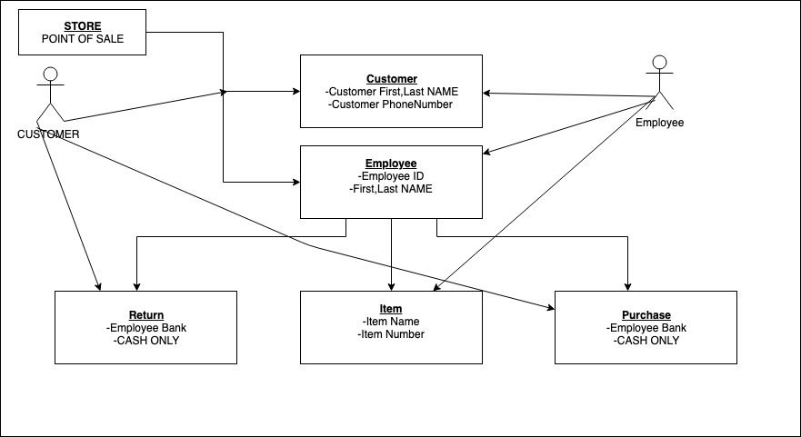

# Individual Project Proposal

## Project Abstract
For this project, I would like to proposal the idea of creating a point-of-sale system. After working for the sales department of a Technology company, I realized this is one part most companies fail to update or improve on after the first few years. I have always wanted to make a POS system and I think it would be interesting to see what the class would come up with. I think there is a simply yet complex way to approach this project that will make it fun. 

## Project Relevance
I think this project would be relevance for this class because this is something that can be useful in the real world. Building something that can be beneficial, can help us use these ideas in an real life work environment. Most of the topics that are covered in this course can be implemented for this project.  Object Oriented Design, user interface, test driven development can all be used for this project. 

## Conceptual Design
For this project, there should be two main parts: Customer and Employee. 
Every Customer should have an account linked to this, that being their name and phone number. This will help identifying each customerr and help it there are any problems that can occur.
For the Employee side, each user should have an ID associated with them. They most enterr there ID before being able to use the system. 
These two are the very basic requirements needed for a POS system to work. After this, adding in the items that are being sold and payment. For the purpose of this class, cash could be the only way a sale can be paid for.
